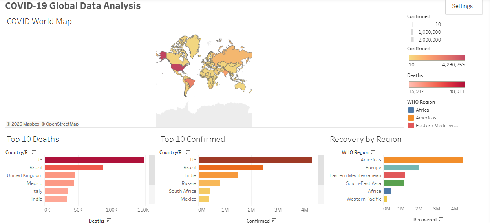

# 📊 COVID-19 Global Data Analysis — Tableau Dashboard

## 📌 Project Overview
This project analyzes global COVID-19 data using Tableau Public. 
It includes an interactive dashboard with 4 visualizations covering 
confirmed cases, deaths, and recovery across countries and regions.

## 🛠️ Tools Used
- Tableau Public
- Dataset: Kaggle — Corona Virus Report by imdevskp

## 📂 Dataset
- Source: [Kaggle - Corona Virus Report](https://www.kaggle.com/datasets/imdevskp/corona-virus-report)
- File used: country_wise_latest.csv
- 187 countries, 15 columns

## 📊 Dashboard Visualizations
| # | Chart | Description |
|---|---|---|
| 1 | COVID World Map | Confirmed cases by country using filled map |
| 2 | Top 10 Deaths | Countries with highest death toll |
| 3 | Top 10 Confirmed | Countries with most confirmed cases |
| 4 | Recovery by Region | Recovered cases by WHO Region |

## 🔍 Key Findings
- US and Brazil had the highest confirmed cases and deaths globally
- Americas region had the highest recovery count
- India and Russia ranked in top 5 for confirmed cases
- Western Pacific had the lowest recovery numbers

## 🔗 Live Dashboard
👉 [View on Tableau Public](https://public.tableau.com/app/profile/sreelakshmi.p.s/viz/COVID-19GlobalDataAnalysis_17824672520880/COVID-19Dashboard)

## 📸 Dashboard Preview

## 📁 Files
- `covid19_dashboard.png` — Dashboard screenshot
